# Game Design Document: Office Feud Web App

## 1. Overview
A web-based, interactive game show application inspired by "Family 100," designed specifically for an office gathering. The game features a dual-view system (Admin Control Panel vs. Public Game View), automated team randomization, timer mechanics, and classic strike/steal rules. 

Using persistent storage in browser.

## 2. Setup & Configuration
* **Participant Upload:** A text input or file upload accepting a comma-separated string of 42 names. (like example/participant.csv)
* **Team Randomization:** An algorithm that takes the 42 names, shuffles them, and divides them equally into 6 teams (7 members per team).
* **Question Upload:** A file upload accepting a JSON file containing the questions for both Round 1 and Round 2 (Data schema defined below). (like example/question.json)

## 3. Game Loop & Mechanics

### Round 1: Score Gathering
* **Structure:** 6 teams play sequentially. Each team gets 1 unique set of questions (6 sets total). Each set contains answers totaling exactly 100 base points.
* **Timer:** 60-second countdown timer per team.
* **Scoring:** Points are awarded for correct answers.
* **Time Bonus:** When you finish a team’s turn (unless they gave up), remaining seconds on the clock are added as bonus points (max 30). The timer stops automatically when the board is cleared so leftover time is preserved until you finish the turn.
* **Give Up Condition:** A "Give Up" button becomes active **only if**:
  1. Half the round time or less remains on the clock (e.g. ≤30s on a 60s timer).
  2. The team has successfully revealed at least 1 answer.
* **Maximum mistakes:** Each team may accumulate at most **3** mistakes (wrong guesses) during their Round 1 turn.

### Round 2: Final Round (Top 2 Teams)
* **Structure:** The top 2 teams on the leaderboard advance to the Final Round. 1 single set of questions is used (total 60 points).
* **Face-off:** On the admin screen, reveal answers as needed (they appear on the public board without adding to the bank), then select which team won the face-off. The winning team gets control of the board.
* **Control Phase:** The controlling team attempts to guess the remaining answers on the board.
* **Mistakes (Strikes):** If the controlling team guesses incorrectly, they get a "Strike." Accumulating 3 strikes triggers a "Steal" opportunity.
* **Steal Phase:** Control throws to the opposing team. If the opposing team guesses *any* of the remaining answers correctly, they steal the total points accumulated in the bank for that round. If they fail, the original controlling team keeps the banked points.

## 4. Features & Views Layout

### Admin View (Control Panel)
This view is private to the host and controls the Public Game View.
* **Navigation:** Buttons to transition between Setup, Round 1, Round 2, and Leaderboard.
* **Question Controls:** Visible list of all answers and points. Clickable toggles to reveal answers on the Game View.
* **Timer Controls:** Start, Pause, Reset, and "Give Up" buttons.
* **Strike System:** A prominent "Mistake / X" button to trigger the strike animation and sound.
* **Manual Override:** Inputs to manually adjust team scores if necessary.

### Public Game View (Projector Screen)
This view is displayed to the audience and listens to state changes from the Admin View.
* **Visuals:** Highly visual, animated interface mirroring classic TV game shows.
* **Leaderboard (Classement):** Real-time ranking of all 6 teams.
* **Game Board:** Hidden panels that flip/animate to reveal answers and points.
* **Timer:** Animated progress bar or large digital clock for the 60-second countdown.
* **Strike Animation:** Massive red "X" overlays that appear on screen when triggered by the admin.
* **Final Score:** End-of-game celebration animation showing the final winning team.

### Audio & Assets
* Use sound assets sourced from: `https://github.com/joshzcold/Friendly-Feud`
* **Events triggering audio:**
  * Theme music (Looping during setup/leaderboard).
  * "Ding" (Correct answer reveal).
  * "Buzzer" (Strike/Mistake triggered).
  * Time ticking (Last 10 seconds of Round 1).

## 5. Visual reference (screenshots)

Reference captures of the Admin control panel and Public (projector) views. Assets live under [`screenshots/`](screenshots/).

### Admin — control panel

| Screen | Preview |
|--------|---------|
| Setup | 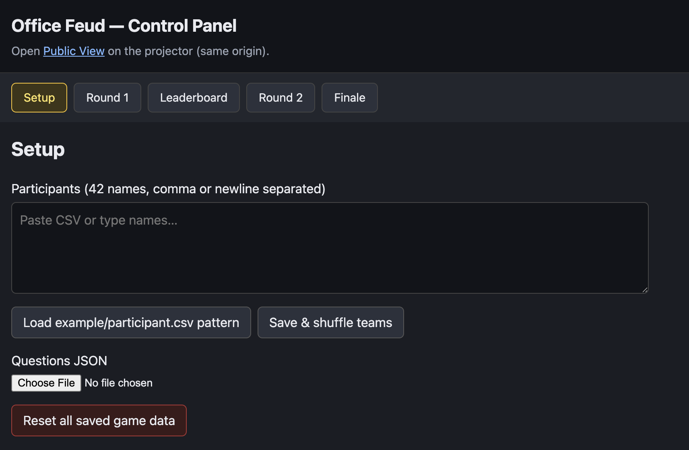 |
| Setup (filled) | 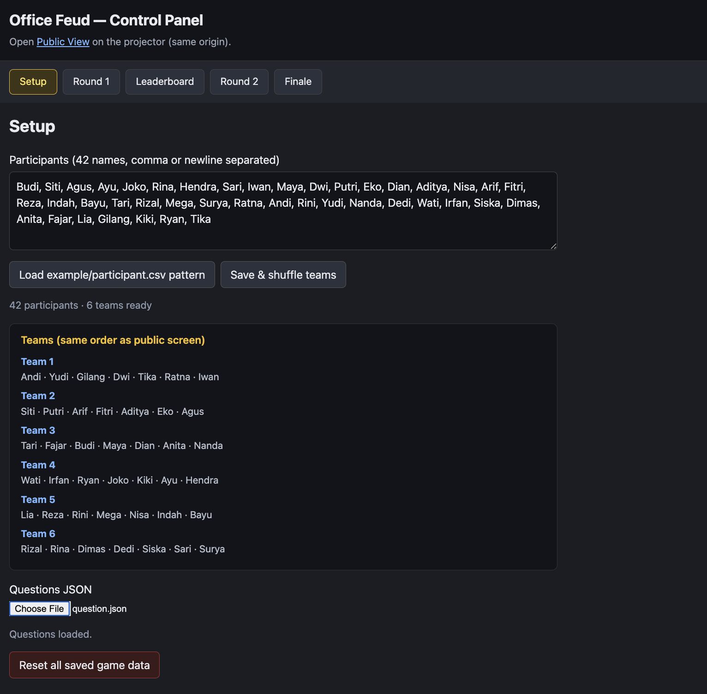 |
| Round 1 | 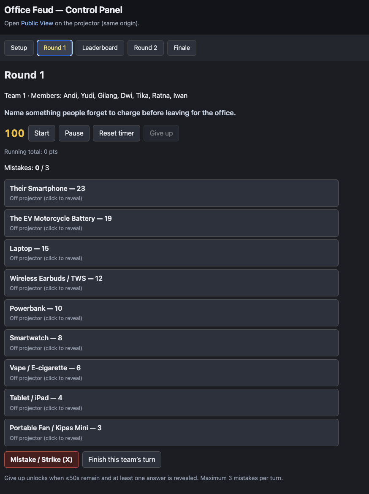 |
| Round 2 | 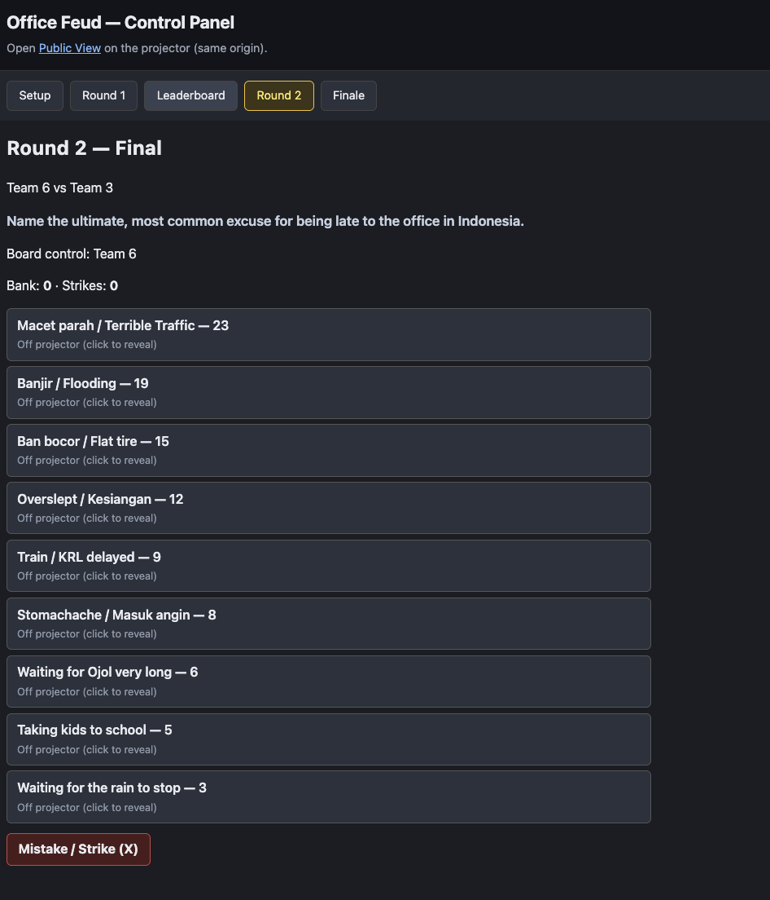 |
| Leaderboard | 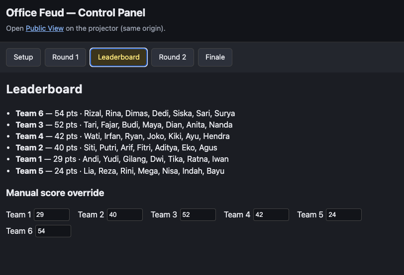 |
| Finale | 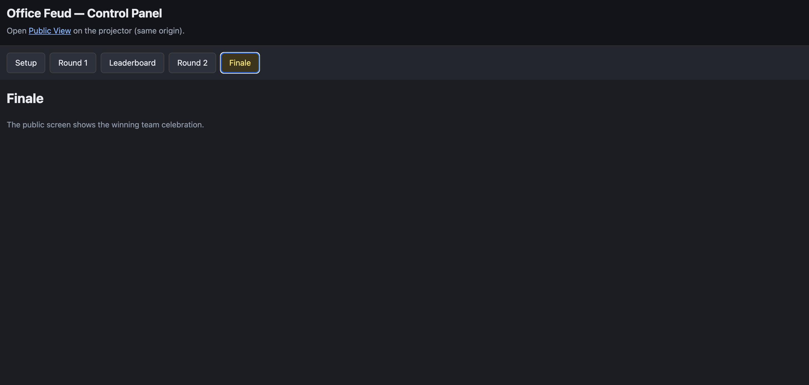 |

### Public — projector view

| Screen | Preview |
|--------|---------|
| Setup | 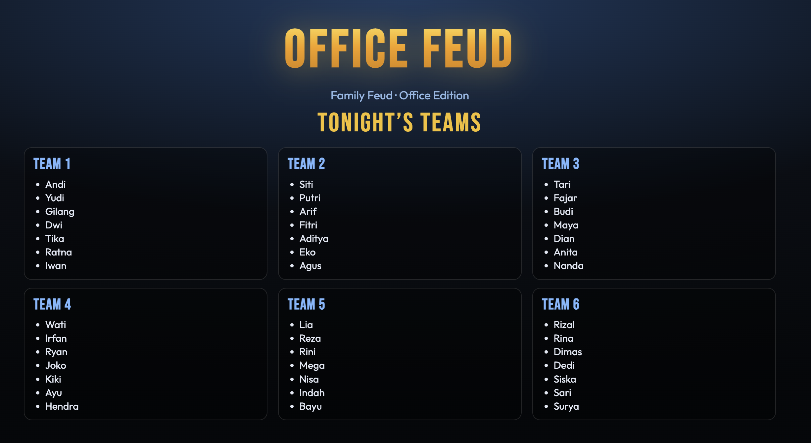 |
| Round 1 | 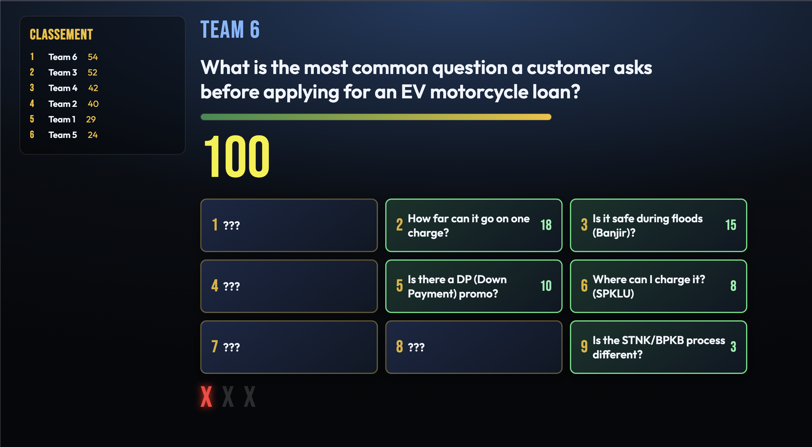 |
| Round 2 | 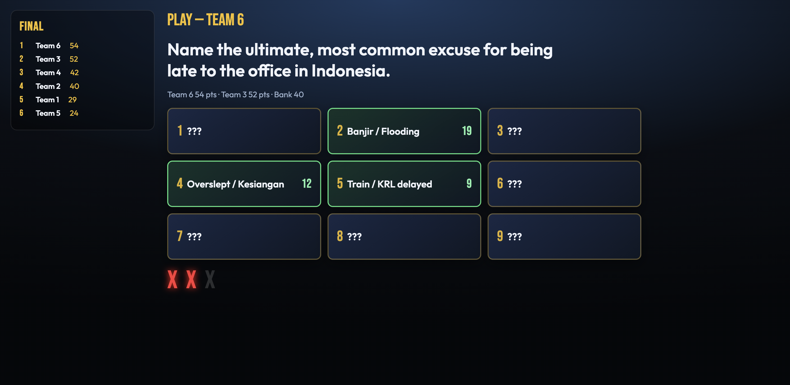 |
| Leaderboard | 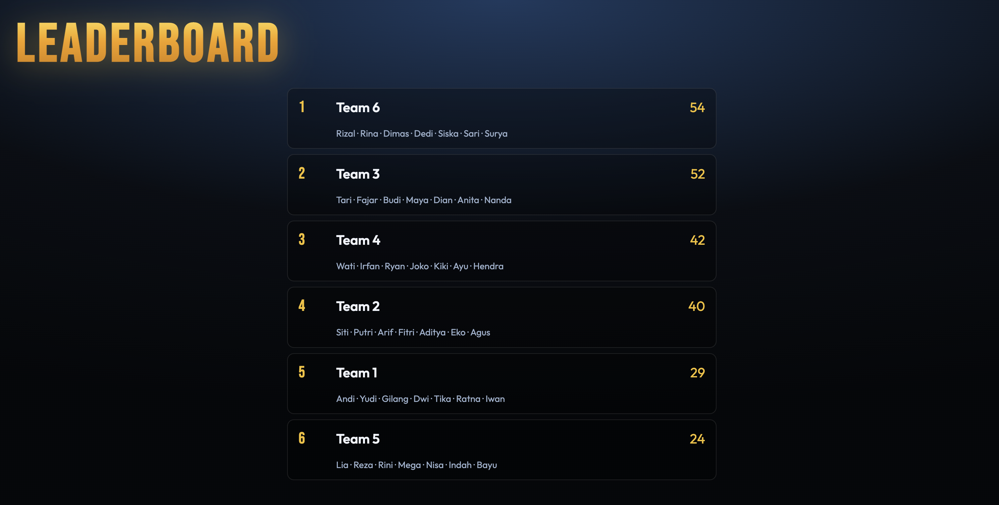 |
| Finale | 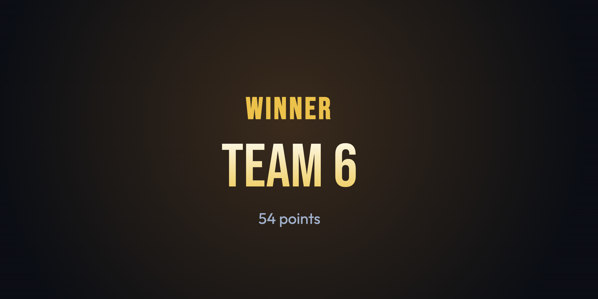 |

## 6. Data Models (JSON Schemas)

### Question File Schema
```json
{
  "round1": [
    {
      "setId": 1,
      "assignedTeam": "Team 1",
      "question": "Name something people forget to charge before leaving for the office.",
      "answers": [
        { "text": "Their Smartphone", "points": 40 },
        { "text": "The EV Motorcycle", "points": 30 },
        { "text": "Laptop", "points": 20 },
        { "text": "Wireless Earbuds / TWS", "points": 10 }
      ]
    },
    {
      "setId": 2,
      "assignedTeam": "Team 2",
      "question": "Name something you always see on the streets during the morning commute in Indonesia.",
      "answers": [
        { "text": "Macet / Crazy Traffic", "points": 40 },
        { "text": "Ojol (Ride-hailing drivers)", "points": 30 },
        { "text": "Street Food / Starling", "points": 15 },
        { "text": "Riders with jackets on backward", "points": 15 }
      ]
    },
    {
      "setId": 3,
      "assignedTeam": "Team 3",
      "question": "Name a reason an employee might suddenly be overly nice to the Finance/HR team.",
      "answers": [
        { "text": "Checking on a Reimbursement", "points": 45 },
        { "text": "Bonus/Payday is approaching", "points": 30 },
        { "text": "Asking for a budget increase", "points": 15 },
        { "text": "Lost a physical receipt", "points": 10 }
      ]
    },
    {
      "setId": 4,
      "assignedTeam": "Team 4",
      "question": "What is the biggest 'flex' or brag when you ride an EV motorcycle to work?",
      "answers": [
        { "text": "Skipping the gas station lines", "points": 35 },
        { "text": "Super quiet motor", "points": 25 },
        { "text": "Saving the planet / Eco-friendly", "points": 25 },
        { "text": "Instant acceleration", "points": 15 }
      ]
    },
    {
      "setId": 5,
      "assignedTeam": "Team 5",
      "question": "Name something you pretend to be doing when your boss walks past your desk.",
      "answers": [
        { "text": "Typing furiously", "points": 40 },
        { "text": "Reading a complex spreadsheet", "points": 30 },
        { "text": "Frowning intensely at the monitor", "points": 20 },
        { "text": "Organizing desk papers", "points": 10 }
      ]
    },
    {
      "setId": 6,
      "assignedTeam": "Team 6",
      "question": "What is the most common question a customer asks before applying for an EV motorcycle loan?",
      "answers": [
        { "text": "How long does the battery last?", "points": 40 },
        { "text": "What's the monthly installment?", "points": 30 },
        { "text": "Is it safe in floods / Banjir?", "points": 20 },
        { "text": "How fast can it go?", "points": 10 }
      ]
    }
  ],
  "round2": {
    "assignedTeam": "Top 2 Teams",
    "question": "Name the ultimate, most common excuse for being late to the office in Indonesia.",
    "answers": [
      { "text": "Banjir / Flooding", "points": 40 },
      { "text": "Ban bocor / Flat tire", "points": 30 },
      { "text": "Traffic was worse than usual", "points": 20 },
      { "text": "Overslept / Kesiangan", "points": 10 }
    ]
  }
}